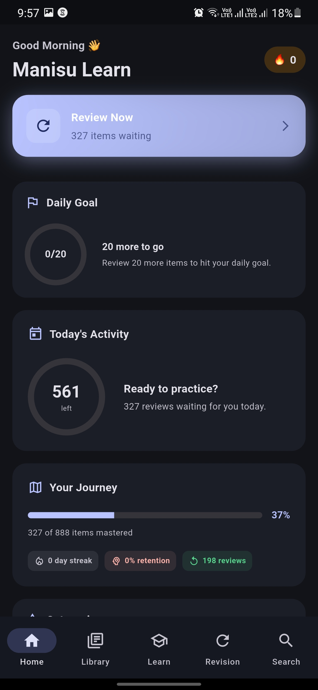
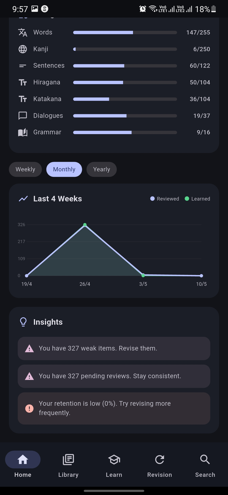
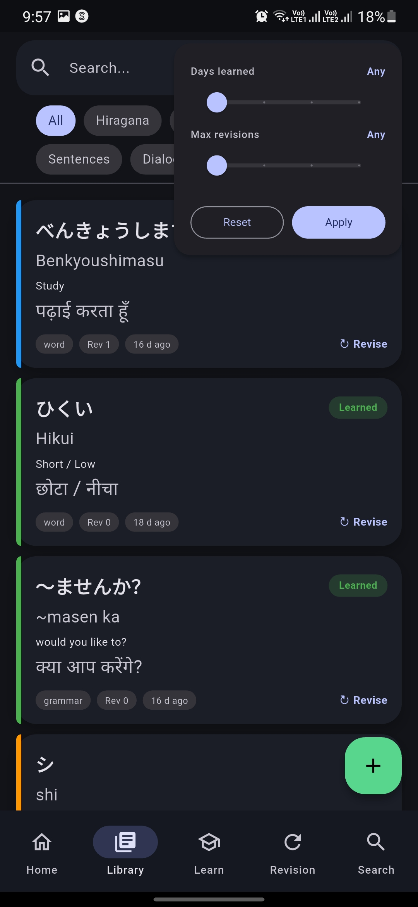
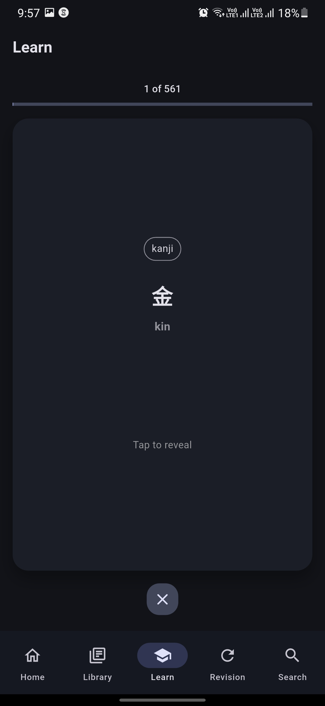
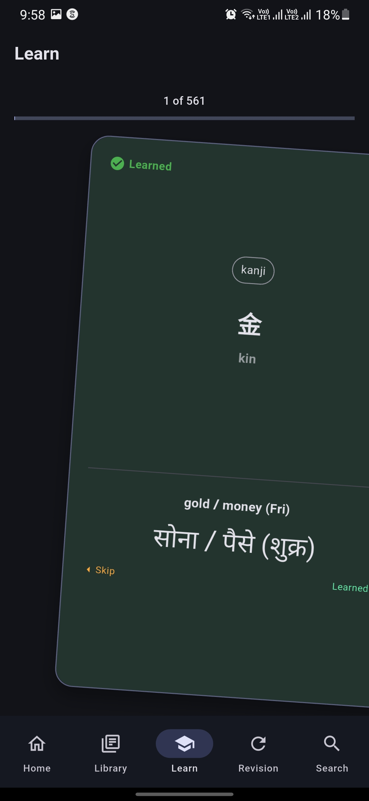
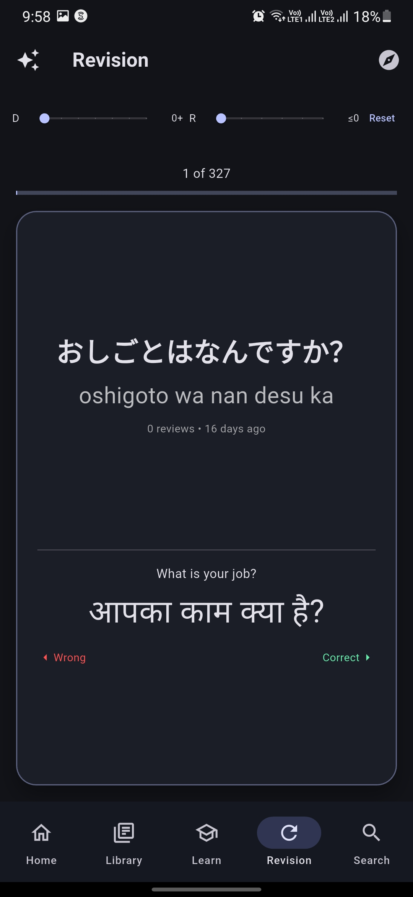
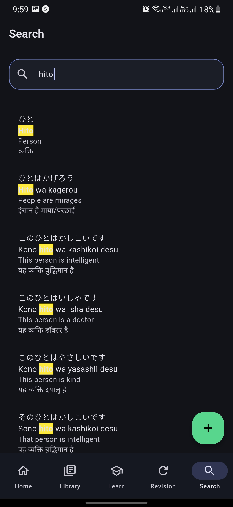

# Manisu Learn

<div align="center">
  <h3>Manisu Learn</h3>
  <p><strong>Offline-first Japanese learning app for Hindi and English speakers</strong></p>
  <p>Built by Manishkumar Vishwakarma with Flutter, Hive, BLoC, and AI-assisted development</p>

  
  
  
  
  
</div>

---

## About

**Manisu Learn** is a multilingual Japanese learning application focused on learning, revising, searching, and managing Japanese study material completely offline. The app is designed especially for learners who want Japanese content with **romaji**, **Hindi**, and **English** support in one place.

The project uses bundled JSON data as the initial content source and stores everything locally in Hive. User progress is preserved across app launches and across bundled-data updates through a simple data-version migration flow.

**Creator:** Manishkumar Vishwakarma

---

## Key Features

### Japanese Learning Content

- Hiragana learning data
- Katakana learning data
- Kanji entries
- Words and vocabulary
- Sentences
- Dialogues
- Grammar notes
- Multilingual fields for Japanese, romaji, Hindi, and English
- Tag support for grouping and filtering items

### Offline-First Local Storage

- No backend required
- Bundled JSON files under `assets/data/`
- Hive database for local persistence
- `LearningItem` model shared across all content types
- Data version tracking with `AppMetaService`
- Automatic reload of bundled JSON when the data version changes
- Existing learning progress preserved during data refreshes

### Learn Mode

- Flashcard-style learning flow
- Shows only unlearned items
- Tap to reveal translations
- Swipe right to mark an item as learned
- Swipe left to skip an item
- Progress indicator for the current learning session
- Empty-state flow when all items are completed

### Revision Mode

- Spaced repetition revision system inspired by SM-2
- Due-item queue based on `nextReview`
- Correct and wrong review actions
- Ease factor, interval, repetitions, revision count, and last review tracking
- Explore mode for revising learned items outside the due queue
- Revision filters for days since learned and maximum repetitions

### Library

- Browse all learning items from one place
- Filter by item type
- Search inside the library
- Advanced filters for learning age and revision count
- Infinite-scroll style pagination
- Pull-to-refresh support
- Quick learn or revise interaction from library items

### Search

- Local search across Japanese, romaji, Hindi, English, tags, and status
- Debounced search input
- Paginated results
- Search result cards with highlighted context
- Works without network access

### Home and Analytics

- Dashboard-style home screen
- Review-now or start-learning primary action
- Daily goal card
- Today progress summary
- Journey summary with learned count, total count, retention, streak, and reviews
- Category breakdown by content type
- Weekly, monthly, and yearly progress chart views
- Insight messages for weak items, pending reviews, and retention trends

### Add Data

- Manual learning-item entry
- JSON import for adding multiple items
- Required fields validation
- Automatic unique ID creation for manually added content
- Add-data flow refreshes library, learn, revision, and due-item state

### App Experience

- Dark-mode-first Material 3 interface
- Persistent bottom navigation
- Independent navigation stacks per tab
- Floating action button for adding data from Library and Search
- BLoC-driven state management
- Feature-based clean architecture

---

## Tech Stack

| Technology | Purpose |
| --- | --- |
| Flutter | Cross-platform application framework |
| Dart 3.8+ | Application language |
| Material 3 | UI components and theme foundation |
| flutter_bloc | Feature state management |
| Equatable | Value equality for BLoC events and states |
| Hive | Local NoSQL persistence |
| hive_flutter | Flutter integration for Hive |
| hive_generator | Hive adapter generation support |
| build_runner | Code generation tooling |
| path_provider | Platform storage path support |
| confetti | Celebration animation support |
| flutter_lints | Recommended lint rules |

---

## Project Structure

```text
manisulearn/
|-- assets/
|   `-- data/
|       |-- dialogues.json
|       |-- grammars.json
|       |-- hiragana.json
|       |-- kanji.json
|       |-- katakana.json
|       |-- sentences.json
|       `-- words.json
|
|-- lib/
|   |-- core/
|   |   |-- constants/            # Item type definitions
|   |   |-- navigation/           # App shell, tabs, routes
|   |   |-- services/             # JSON loading, analytics, app metadata, SM-2 logic
|   |   |-- theme/                # Dark Material 3 theme
|   |   `-- utils/                # Search and error helpers
|   |
|   |-- data/
|   |   |-- local/                # Hive box and local data source setup
|   |   |-- models/               # LearningItem model and Hive adapter
|   |   `-- repositories/         # Hive repository implementation
|   |
|   |-- domain/
|   |   |-- entities/
|   |   |-- models/               # Analytics data models
|   |   `-- repositories/         # Repository contracts
|   |
|   |-- features/
|   |   |-- add_data/             # Manual entry and JSON import
|   |   |-- home/                 # Analytics dashboard
|   |   |-- learn/                # New item learning flow
|   |   |-- library/              # Browse, filter, and manage content
|   |   |-- revision/             # Due reviews and learned-item revision
|   |   `-- search/               # Local multilingual search
|   |
|   `-- main.dart
|
|-- android/
|-- ios/
|-- linux/
|-- macos/
|-- web/
|-- windows/
|-- test/
|-- pubspec.yaml
`-- README.md
```

---

## Data Sources

The app ships with local JSON data files:

| File | Content | Current Entries |
| --- | --- | ---: |
| `assets/data/hiragana.json` | Hiragana | 104 |
| `assets/data/katakana.json` | Katakana | 104 |
| `assets/data/kanji.json` | Kanji | 250 |
| `assets/data/words.json` | Words | 255 |
| `assets/data/sentences.json` | Sentences | 122 |
| `assets/data/grammars.json` | Grammar | 16 |
| `assets/data/dialogues.json` | Dialogues | 37 |

Total bundled learning items: **888**.

---

## Data Model

All learning content is represented by a single Hive model: `LearningItem`.

```dart
LearningItem(
  id: 'word_1',
  type: 'word',
  japanese: 'こんにちは',
  romaji: 'konnichiwa',
  hindi: 'नमस्ते',
  english: 'hello',
  isLearned: false,
  revisionCount: 0,
  tags: ['greeting'],
)
```

Tracked progress fields include:

| Field | Purpose |
| --- | --- |
| `isLearned` | Whether the item has been learned |
| `revisionCount` | Number of revision attempts |
| `lastReviewed` | Last review timestamp |
| `difficulty` | Difficulty metadata |
| `easeFactor` | SM-2 ease factor |
| `interval` | Current spaced repetition interval in days |
| `repetitions` | Successful repetition count |
| `nextReview` | Next due date |
| `firstLearnedAt` | First learned timestamp |

---

## Architecture

Manisu Learn follows a feature-based clean architecture style.

```text
UI -> BLoC -> Repository -> Local Data Source -> Hive
```

### Core Layers

| Layer | Responsibility |
| --- | --- |
| `core` | Navigation, theme, shared services, constants, utilities |
| `features` | UI pages, widgets, BLoCs, events, and states per feature |
| `data` | Hive models, local data sources, repository implementations |
| `domain` | Repository contracts and app-level data models |

### Main Runtime Flow

1. Flutter bindings are initialized.
2. Hive is initialized with `Hive.initFlutter()`.
3. `LearningItemAdapter` is registered.
4. The `learning_items` box is opened.
5. The app checks the stored data version.
6. If bundled data is newer, JSON files are loaded and Hive is refreshed.
7. Existing user progress is preserved during refresh.
8. Global repositories and BLoCs are provided.
9. `AppShell` renders the bottom-tab app experience.

---

## Navigation

The app uses a persistent bottom navigation shell with five main tabs:

| Tab | Purpose |
| --- | --- |
| Home | Progress, analytics, insights, and primary next action |
| Library | Browse and filter all study material |
| Learn | Learn new unlearned items |
| Revision | Review due or learned items |
| Search | Search across all local content |

The floating action button opens Add Data from Library and Search.

---

## Getting Started

### Prerequisites

- Flutter SDK 3.x
- Dart 3.8 or newer
- Android Studio, Xcode, or a desktop Flutter target
- Git

### Install Dependencies

```bash
flutter pub get
```

### Run the App

```bash
flutter run
```

### Run on a Specific Target

```bash
flutter devices
flutter run -d <device-id>
```

### Run Tests

```bash
flutter test
```

### Analyze Code

```bash
flutter analyze
```

### Build Examples

```bash
flutter build apk
flutter build appbundle
flutter build web
flutter build windows
```

---

## Updating Bundled Data

To update the local learning dataset:

1. Edit or add entries in `assets/data/*.json`.
2. Keep each entry in the expected JSON format.
3. Bump `currentDataVersion` in `lib/main.dart`.
4. Run the app.
5. On startup, the app reloads bundled data into Hive.
6. Existing progress fields are preserved for matching item IDs.

Example JSON item:

```json
{
  "id": "word_1",
  "type": "word",
  "japanese": "こんにちは",
  "romaji": "konnichiwa",
  "hindi": "नमस्ते",
  "english": "hello",
  "tags": ["greeting"]
}
```

---

## Spaced Repetition

Revision uses a lightweight SM-2 style service in:

```text
lib/core/services/spaced_repetition_service.dart
```

The review algorithm tracks:

- Review quality from 0 to 5
- Ease factor with a minimum value of 1.3
- Repetition count
- Review interval in days
- Next review date
- Revision count
- Last reviewed timestamp

Due items are selected when:

```text
item.isLearned == true
item.nextReview <= now
```

Due items are prioritized by next review date, ease factor, and revision count.

---

## Mobile Screenshots

### Dashboard

<p align="center">
  
  
</p>

### Library

<p align="center">
  
</p>

### Learn

<p align="center">
  
  
</p>

### Revision

<p align="center">
  
</p>

### Search Data

<p align="center">
  
</p>

---

## Important Files

| File | Purpose |
| --- | --- |
| `lib/main.dart` | App bootstrap, Hive setup, data migration, providers |
| `lib/core/navigation/app_shell.dart` | Bottom navigation and tab stacks |
| `lib/core/services/json_loader.dart` | Loads bundled JSON learning data |
| `lib/core/services/app_meta_service.dart` | Stores local data version |
| `lib/core/services/spaced_repetition_service.dart` | Review scheduling logic |
| `lib/core/services/analytics_service.dart` | Computes dashboard analytics |
| `lib/data/models/learning_item.dart` | Main Hive data model |
| `lib/data/repositories/hive_learning_item_repository.dart` | Repository implementation |
| `lib/features/home/presentation/pages/home_page.dart` | Dashboard screen |
| `lib/features/library/presentation/pages/library_page.dart` | Library browsing and filters |
| `lib/features/learn/presentation/pages/learn_page.dart` | Flashcard learning UI |
| `lib/features/revision/presentation/pages/revision_page.dart` | Review UI |
| `lib/features/search/presentation/pages/search_page.dart` | Local search UI |
| `lib/features/add_data/presentation/pages/add_data_page.dart` | Manual and JSON data entry |

---

## Acknowledgments

- Manishkumar Vishwakarma - Project Founder and Developer
- AI Development Assistant
- Flutter and Dart
- Hive
- BLoC Library
- The Japanese language learning community

---

<div align="center">
  <p>Made with care, code, and AI-assisted development.</p>
  <p><strong>Manisu Learn</strong></p>
  <p>Crafted for Japanese learning with Hindi and English support.</p>
</div>
